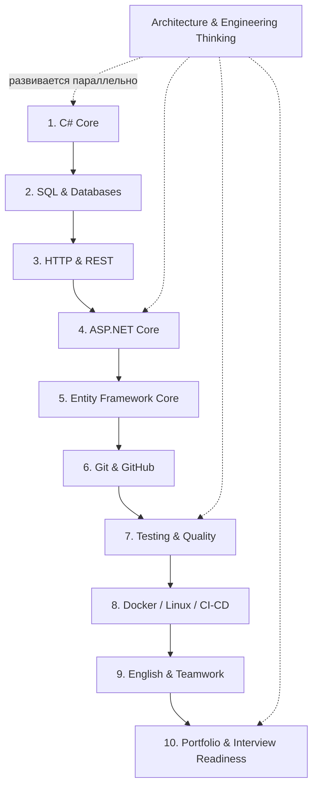

# SoftwareEngineeringBase

> Личная база знаний по Software Engineering: от уверенного Junior C#/.NET до инженерного мышления.

## 📚 Режим чтения

Этот GitHub-репозиторий хранит исходные Markdown-файлы и историю изменений. Для обычного чтения база публикуется как отдельный документационный сайт на **MkDocs Material**, где доступны верхняя навигация, боковое меню и поиск.

После включения GitHub Pages сайт будет доступен по адресу:

**https://kirillshyrokyi.github.io/SoftwareEngineeringBase/**

Основной язык объяснений — **русский**. Английские термины всегда сохраняются рядом, потому что именно их ты увидишь в коде, документации, GitHub, на собеседованиях и в международной команде.

Например:

- область видимости — **scope**;
- тип значения — **value type**;
- ссылочный тип — **reference type**;
- внедрение зависимостей — **Dependency Injection (DI)**;
- слабая связанность — **low coupling**;
- высокая связность ответственности — **high cohesion**.

---

## 🎯 Цель базы

Не собрать словарь из сотен терминов, а научиться отвечать на четыре вопроса о любой части программы:

1. **Какие данные существуют?**
2. **Куда они передаются?**
3. **Кто имеет право изменить состояние?**
4. **Что выходит наружу как результат?**

Главный критерий готовности Junior:

> Я способен самостоятельно сделать небольшое рабочее приложение, читать чужой код и объяснить, почему написал свой код именно так.

---

## 🧭 Главный маршрут



Это не означает, что архитектуру нужно отложить до конца. **Architecture, debugging, security и engineering thinking проходят через весь маршрут поперёк остальных тем.**

---

## 🧠 Как будет устроено знание

Каждая тема должна отвечать не только на вопрос «что это?», но и на вопросы:

- **Why?** — зачем эта идея вообще появилась;
- **How?** — как она работает;
- **When?** — когда её применять;
- **When not?** — когда она не нужна или вредна;
- **What is it connected to?** — с какими другими понятиями она связана;
- **Can I explain it?** — могу ли я объяснить это своими словами без подсказки.

Пример цепочки связей:

```text
interface
   ↓
Dependency Injection
   ↓
Dependency Inversion
   ↓
low coupling
   ↓
easier testing
```

Так база должна превращаться в **сеть понимания**, а не в набор изолированных определений.

---

## 📖 Правило языка

Формат по умолчанию:

> **Русское объяснение → English term → смысл в контексте → пример → связь с другими понятиями.**

Мы не переводим программирование целиком на русский. Английский термин нужно узнавать мгновенно, но понимать его смысл можно и нужно сначала на наиболее удобном языке.

Например:

> **Область видимости (scope)** — участок программы, внутри которого конкретное имя доступно для обращения из кода.

После этого термин `scope` уже не является случайным английским словом: за ним стоит понятная модель.

---

## ✅ Статусы изучения

- [ ] **Не изучено** — тема ещё не разобрана;
- 🟡 **Разбираю** — понимаю основу, но ещё есть вопросы;
- 🟢 **Понимаю** — могу объяснить своими словами и решить базовую задачу;
- 🔵 **Закреплено** — применял на практике и могу связать с другими темами.

Цель — не поставить 50 галочек как можно быстрее. Цель — добиться состояния, когда знания можно **восстановить логикой**, даже если формулировка определения забылась.

---

## 🏁 Когда можно считать себя готовым подаваться на Junior

Ты способен без пошаговой инструкции собрать примерно такую систему:

```text
ASP.NET Core REST API
        ↓
Authentication
        ↓
Business logic
        ↓
EF Core
        ↓
PostgreSQL

+ validation
+ logging
+ exception handling
+ unit tests
+ integration tests
+ Docker
+ Git
+ README
```

И можешь объяснить:

- почему здесь интерфейс;
- почему здесь scoped dependency;
- почему DTO отличается от entity;
- почему запрос async;
- почему это правило находится в Domain/Application;
- почему здесь transaction;
- как API возвращает ошибку;
- как данные доходят от HTTP до базы.

---

## 🚫 Что пока не является приоритетом

До уверенной Junior-базы не нужно глубоко уходить в:

`Kubernetes`, `Kafka`, `RabbitMQ`, `Redis internals`, `Elasticsearch`, `microservices`, `CQRS`, `Event Sourcing`, `advanced DDD`, `distributed consensus`, `advanced system design`, `advanced cloud architecture`.

Это не «плохие» темы. Просто сейчас они способны отнять внимание у фундамента.

---

### Принцип репозитория

> **Не учить термин ради термина. Понять проблему, из которой термин появился.**
