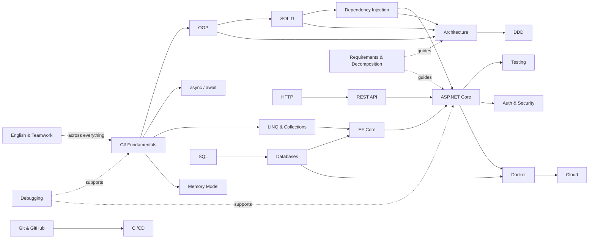

# Junior C#/.NET Roadmap

> Эта карта построена из исходного списка навыков Junior C#/.NET и перегруппирована по зависимостям между знаниями, а не просто по порядку терминов.

[← На главную](README.md) · [Как учиться](STUDY_SYSTEM.md)

---

## Как читать эту карту

Есть три типа тем:

- **Core** — без этого трудно работать даже на Junior;
- **Support** — поддерживает основной стек и делает тебя самостоятельнее;
- **Advantage** — преимущество для Junior, но не входной билет.

Мы будем двигаться не по принципу «закрыть 50 пунктов», а по цепочке зависимостей:

```text
Programming fundamentals
        ↓
C# language model
        ↓
OOP + design principles
        ↓
HTTP / SQL / databases
        ↓
ASP.NET Core + EF Core
        ↓
Testing + security + deployment
        ↓
Independent engineering work
```

---

# Level 1 — Programming Fundamentals

**Цель:** перестать видеть программу как набор строк и начать видеть поток данных, управление и изменение состояния.

### 1. База C# — C# Fundamentals `Core`

- [ ] primitive/basic types: `int`, `double`, `decimal`, `bool`, `string`, `DateTime`;
- [ ] nullable types;
- [ ] variables — переменные;
- [ ] scope — область видимости;
- [ ] `if / else`;
- [ ] `switch`;
- [ ] `for`, `foreach`, `while`;
- [ ] methods — методы;
- [ ] parameters — параметры;
- [ ] `return`;
- [ ] `ref` / `out`;
- [ ] arrays;
- [ ] `List<T>`;
- [ ] `Dictionary<TKey,TValue>`;
- [ ] `HashSet<T>`;
- [ ] generics;
- [ ] enums;
- [ ] records;
- [ ] tuples;
- [ ] exceptions: `try/catch/finally`;
- [ ] `using`;
- [ ] namespaces.

### Ментальная модель

```text
DATA
 ↓
CONTROL FLOW
 ↓
LOGIC
 ↓
STATE CHANGE / RESULT
```

После блока я должен уметь проследить:

> какие данные вошли → какой код принял решение → что изменилось → что вернулось наружу.

---

# Level 2 — C# Object Model

## 2. OOP — Object-Oriented Programming `Core`

- [ ] class;
- [ ] object;
- [ ] constructor;
- [ ] property;
- [ ] field;
- [ ] `public`, `private`, `protected`, `internal`;
- [ ] encapsulation;
- [ ] abstraction;
- [ ] inheritance;
- [ ] composition;
- [ ] polymorphism;
- [ ] interface;
- [ ] abstract class;
- [ ] composition vs inheritance.

Ключевая мысль:

```text
Car HAS Engine  → composition
Dog IS Animal   → inheritance relationship
```

Наследование не должно использоваться просто ради повторного использования нескольких строк кода.

---

## 3. Coupling & Cohesion `Core`

- [ ] coupling — связанность компонентов между собой;
- [ ] low coupling;
- [ ] cohesion — логическая цельность ответственности;
- [ ] high cohesion.

Связь:

```text
high cohesion
      +
low coupling
      ↓
easier change
      ↓
easier testing
      ↓
more maintainable system
```

---

## 4. SOLID `Core`

- [ ] **S — Single Responsibility Principle**;
- [ ] **O — Open/Closed Principle**;
- [ ] **L — Liskov Substitution Principle**;
- [ ] **I — Interface Segregation Principle**;
- [ ] **D — Dependency Inversion Principle**.

Цель — не воспроизводить определения наизусть, а узнавать проблему, которую каждый принцип пытается предотвратить.

---

## 5. Dependency Injection — DI `Core`

- [ ] constructor injection;
- [ ] dependency inversion;
- [ ] `IServiceCollection`;
- [ ] `Transient`;
- [ ] `Scoped`;
- [ ] `Singleton`;
- [ ] lifetime mismatch.

Минимальная строка, которую нужно уметь объяснить целиком:

```csharp
services.AddScoped<ITradeRepository, TradeRepository>();
```

---

# Level 3 — Runtime Thinking

## 6. Asynchronous Programming `Core`

- [ ] `Task`;
- [ ] `Task<T>`;
- [ ] `async`;
- [ ] `await`;
- [ ] почему `.Result` и `.Wait()` могут быть проблемой;
- [ ] `CancellationToken`;
- [ ] asynchronous vs parallel;
- [ ] race condition;
- [ ] thread safety — базово.

Модель:

```text
async ≠ make CPU work faster
async = do not waste a thread while waiting for I/O
```

---

## 7. LINQ `Core`

- [ ] `Where`;
- [ ] `Select`;
- [ ] `First` / `FirstOrDefault`;
- [ ] `Single` / `SingleOrDefault`;
- [ ] `Any` / `All`;
- [ ] `OrderBy` / `OrderByDescending`;
- [ ] `GroupBy`;
- [ ] `Distinct`;
- [ ] `Count`, `Sum`, `Average`;
- [ ] `ToList`;
- [ ] `ToDictionary`;
- [ ] `IEnumerable<T>` vs materialized collection.

---

## 8. Collections & Complexity `Core`

- [ ] `List<T>`;
- [ ] `Dictionary<TKey,TValue>`;
- [ ] `HashSet<T>`;
- [ ] `Queue<T>` — FIFO;
- [ ] `Stack<T>` — LIFO;
- [ ] базовый смысл `O(1)`, `O(log n)`, `O(n)`, `O(n²)`.

---

## 9. Memory in C# `Core`

- [ ] value types;
- [ ] reference types;
- [ ] stack;
- [ ] heap;
- [ ] Garbage Collector — GC;
- [ ] boxing / unboxing;
- [ ] immutable types;
- [ ] почему `string` immutable;
- [ ] передача значений и ссылок между методами;
- [ ] reference equality vs value equality.

---

# Level 4 — Version Control & Collaboration

## 10. Git `Core`

- [ ] `git clone`;
- [ ] `git status`;
- [ ] `git add`;
- [ ] `git commit`;
- [ ] `git pull`;
- [ ] `git push`;
- [ ] `git branch`;
- [ ] `git switch` / `checkout`;
- [ ] `git merge`;
- [ ] merge conflict;
- [ ] `.gitignore`;
- [ ] revert;
- [ ] reset — понимать риски;
- [ ] squash.

## 11. GitHub `Core`

- [ ] repository;
- [ ] branches;
- [ ] Pull Request — PR;
- [ ] diff;
- [ ] code review;
- [ ] issues;
- [ ] README.

---

# Level 5 — Web Foundation

## 12. HTTP `Core`

- [ ] client / server;
- [ ] request / response;
- [ ] GET;
- [ ] POST;
- [ ] PUT;
- [ ] PATCH;
- [ ] DELETE;
- [ ] headers;
- [ ] body;
- [ ] status codes.

Основные status codes:

```text
200 OK
201 Created
204 No Content
400 Bad Request
401 Unauthorized
403 Forbidden
404 Not Found
409 Conflict
500 Internal Server Error
```

---

## 13. REST API `Core`

- [ ] REST — концептуально;
- [ ] endpoint;
- [ ] Controller;
- [ ] Request;
- [ ] Response;
- [ ] DTO;
- [ ] serialization;
- [ ] JSON;
- [ ] validation;
- [ ] CRUD.

Пример API:

```text
GET    /api/users
GET    /api/users/5
POST   /api/users
PUT    /api/users/5
DELETE /api/users/5
```

---

## 14. ASP.NET Core `Core`

- [ ] `Program.cs`;
- [ ] dependency injection;
- [ ] Controllers;
- [ ] Minimal APIs — понимать;
- [ ] routing;
- [ ] middleware;
- [ ] configuration;
- [ ] `appsettings.json`;
- [ ] environments;
- [ ] logging;
- [ ] exception handling;
- [ ] model binding;
- [ ] validation.

---

## 15. Middleware `Core`

```text
HTTP Request
    ↓
Middleware
    ↓
Middleware
    ↓
Endpoint / Controller
    ↓
HTTP Response
```

- [ ] request pipeline;
- [ ] logging middleware;
- [ ] global exception handling.

---

# Level 6 — Data & Persistence

## 16. SQL `Core`

- [ ] `SELECT`;
- [ ] `INSERT`;
- [ ] `UPDATE`;
- [ ] `DELETE`;
- [ ] `WHERE`;
- [ ] `ORDER BY`;
- [ ] `GROUP BY`;
- [ ] `JOIN`;
- [ ] `INNER JOIN`;
- [ ] `LEFT JOIN`;
- [ ] primary key;
- [ ] foreign key;
- [ ] indexes;
- [ ] constraints;
- [ ] normalization — базово;
- [ ] transactions.

---

## 17. Entity Framework Core `Core`

- [ ] entity;
- [ ] `DbContext`;
- [ ] `DbSet<T>`;
- [ ] relationships;
- [ ] migrations;
- [ ] `Add-Migration`;
- [ ] `Update-Database`;
- [ ] querying;
- [ ] `Include`;
- [ ] `AsNoTracking`;
- [ ] async database operations.

Ключевая связь:

```text
LINQ
 ↓
EF Core
 ↓
SQL
 ↓
Database
```

---

## 18. Databases `Core`

Основная серверная БД для практики: **PostgreSQL** или **SQL Server**.

- [ ] database;
- [ ] table;
- [ ] row;
- [ ] column;
- [ ] keys;
- [ ] indexes;
- [ ] relationships.

SQLite остаётся полезным для локальных приложений и обучения.

---

# Level 7 — Architecture & Domain

## 19. Application Architecture `Core`

Нужно понимать ответственность компонентов, например:

```text
Controller
 ↓
Service / Use Case
 ↓
Repository
 ↓
Database
```

или более слоистую модель:

```text
API / UI
   ↓
Application
   ↓
Domain

Infrastructure реализует внешние детали и подключается через abstractions.
```

---

## 20. Clean Architecture `Advantage`

- [ ] dependency direction;
- [ ] business rules independent from UI;
- [ ] business rules independent from database;
- [ ] business rules independent from external API;
- [ ] overengineering — когда архитектура сложнее задачи.

---

## 21. Domain-Driven Design — DDD `Advantage`

Для Junior — концептуально:

- [ ] Entity;
- [ ] Value Object;
- [ ] Aggregate;
- [ ] Domain Service;
- [ ] Repository;
- [ ] Domain Model;
- [ ] Bounded Context.

---

## 22. DTO `Core`

Нужно понимать:

```text
Domain Entity ≠ Database Entity ≠ API DTO
```

- [ ] request DTO;
- [ ] response DTO;
- [ ] domain model;
- [ ] persistence entity.

---

## 23. Mapping `Core`

- [ ] manual mapping;
- [ ] зачем разделять модели;
- [ ] AutoMapper — только после понимания ручного mapping.

---

## 24. Validation `Core`

- [ ] null checks;
- [ ] empty strings;
- [ ] ranges;
- [ ] invalid IDs;
- [ ] malformed input;
- [ ] business restrictions;
- [ ] input validation vs business rule.

---

## 25. Error Handling `Core`

- [ ] expected error vs unexpected exception;
- [ ] где ловить exception;
- [ ] когда `400`;
- [ ] когда `404`;
- [ ] когда `409`;
- [ ] когда `500`;
- [ ] exception logging;
- [ ] почему пустой `catch { }` опасен.

---

## 26. Logging `Core`

- [ ] `ILogger<T>`;
- [ ] Trace;
- [ ] Debug;
- [ ] Information;
- [ ] Warning;
- [ ] Error;
- [ ] Critical;
- [ ] structured logging — концептуально;
- [ ] полезный context в сообщении.

---

# Level 8 — Testing & Security

## 27. Unit Testing `Core`

- [ ] Arrange;
- [ ] Act;
- [ ] Assert;
- [ ] xUnit;
- [ ] mock;
- [ ] stub;
- [ ] dependency isolation;
- [ ] что действительно стоит unit-тестировать.

---

## 28. Integration Testing `Core`

- [ ] unit vs integration test;
- [ ] HTTP → API → EF → Database;
- [ ] test database — концептуально;
- [ ] проверка интеграционных границ.

---

## 29. Authentication & Authorization `Core`

```text
Authentication → Who are you?
Authorization  → What are you allowed to do?
```

- [ ] JWT;
- [ ] claims;
- [ ] roles;
- [ ] OAuth 2.0 — концептуально;
- [ ] OpenID Connect — концептуально;
- [ ] Auth0 / Keycloak / Microsoft Identity — позже как реализации.

---

## 30. Security Basics `Core`

- [ ] passwords are not stored as plain text;
- [ ] hashing;
- [ ] HTTPS;
- [ ] SQL injection;
- [ ] XSS;
- [ ] CSRF;
- [ ] secrets must not be committed to Git;
- [ ] environment variables / secret storage;
- [ ] least privilege;
- [ ] OWASP Top 10 — базовое понимание.

---

# Level 9 — Runtime Environment & Delivery

## 31. Docker `Support`

- [ ] image;
- [ ] container;
- [ ] Dockerfile;
- [ ] volume;
- [ ] ports;
- [ ] environment variables;
- [ ] `docker build`;
- [ ] `docker run`;
- [ ] Docker Compose;
- [ ] ASP.NET API + PostgreSQL через Compose.

---

## 32. Linux Basics `Support`

Команды:

```bash
cd
ls
mkdir
rm
cp
mv
cat
grep
pwd
```

Понятия:

- [ ] process;
- [ ] service;
- [ ] ports;
- [ ] environment variables;
- [ ] permissions;
- [ ] filesystem.

---

## 33. Networking Basics `Core`

- [ ] IP;
- [ ] port;
- [ ] DNS;
- [ ] HTTP;
- [ ] HTTPS;
- [ ] TCP;
- [ ] localhost;
- [ ] client;
- [ ] server.

Нужно уметь объяснить, почему в `localhost:5000` есть две разные части.

---

## 34. JSON `Core`

- [ ] object;
- [ ] array;
- [ ] nested object;
- [ ] number / string / boolean / null;
- [ ] serialization;
- [ ] deserialization.

---

## 35. External APIs `Core`

```text
create HTTP request
        ↓
authenticate
        ↓
receive JSON
        ↓
deserialize
        ↓
handle failure
        ↓
use result
```

- [ ] `HttpClient`;
- [ ] timeout;
- [ ] cancellation;
- [ ] non-success HTTP response;
- [ ] external dependency failure.

---

# Level 10 — Developer Tools

## 36. Debugging `Core`

- [ ] breakpoint;
- [ ] step into;
- [ ] step over;
- [ ] call stack;
- [ ] watches;
- [ ] locals;
- [ ] exception breakpoint;
- [ ] reproduce → isolate → inspect → verify fix.

---

## 37. Stack Trace `Core`

Нужно уметь читать цепочку вызовов и находить наиболее вероятную точку возникновения ошибки.

```text
NullReferenceException
 at TradingService.Execute()
 at TradingController.Start()
```

---

## 38. IDE — Visual Studio `Core`

- [ ] solution;
- [ ] project;
- [ ] references;
- [ ] NuGet UI;
- [ ] build configuration;
- [ ] debugger;
- [ ] terminal;
- [ ] Git integration.

---

## 39. NuGet `Core`

- [ ] package;
- [ ] dependency;
- [ ] version;
- [ ] transitive dependency;
- [ ] install/update/remove package.

---

## 40. Build & Runtime `Core`

```text
C# source code
     ↓
compiler
     ↓
IL
     ↓
.NET runtime / CLR
     ↓
machine execution
```

- [ ] compiler;
- [ ] IL;
- [ ] CLR;
- [ ] runtime;
- [ ] build;
- [ ] publish.

---

# Level 11 — Delivery & Infrastructure

## 41. CI/CD `Support`

```text
Push
 ↓
Build
 ↓
Tests
 ↓
Deploy
```

- [ ] CI;
- [ ] CD;
- [ ] GitHub Actions;
- [ ] `restore`;
- [ ] `build`;
- [ ] `test`.

---

## 42. Cloud Basics `Support`

Для .NET логично начать с **Azure**.

- [ ] App Service;
- [ ] managed database;
- [ ] storage;
- [ ] environment variables;
- [ ] secrets;
- [ ] deployment.

AWS тоже подходит; задача этого блока — понять облачные модели, а не собрать десяток сертификатов.

---

# Level 12 — Computer Science Foundation

## 43. Algorithms & Data Structures `Core`

Структуры:

- [ ] array;
- [ ] linked list — концептуально;
- [ ] stack;
- [ ] queue;
- [ ] dictionary / hash table;
- [ ] tree — базовая идея.

Алгоритмы:

- [ ] linear search;
- [ ] binary search;
- [ ] sorting;
- [ ] recursion;
- [ ] Big O: `O(1)`, `O(log n)`, `O(n)`, `O(n²)`.

---

## 44. Computer Science Basics `Core`

- [ ] CPU;
- [ ] RAM;
- [ ] storage;
- [ ] process;
- [ ] thread;
- [ ] operating system;
- [ ] filesystem;
- [ ] network;
- [ ] binary representation;
- [ ] compilation;
- [ ] memory.

Цель: компьютер перестаёт быть «магической коробкой».

---

# Level 13 — Working as a Developer

## 45. English for Developers `Core`

Цель сначала — **functional English**, а не идеальная грамматика.

- [ ] читать документацию;
- [ ] понимать task description;
- [ ] читать errors и logs;
- [ ] объяснять свой код;
- [ ] писать commit / PR / рабочее сообщение;
- [ ] понимать вопросы технического интервью;
- [ ] отвечать простыми техническими фразами.

Практический ориентир для международной Junior-работы: **B1 → затем B2**.

---

## 46. Teamwork `Core`

- [ ] задавать вопросы;
- [ ] вовремя сообщать о blocker;
- [ ] принимать code review;
- [ ] аргументировать решение;
- [ ] признавать ошибку;
- [ ] обсуждать alternatives;
- [ ] разделять known / unknown.

---

## 47. Agile / Scrum Basics `Support`

- [ ] Sprint;
- [ ] Backlog;
- [ ] User Story;
- [ ] Task;
- [ ] Bug;
- [ ] Daily;
- [ ] Planning;
- [ ] Review;
- [ ] Retrospective;
- [ ] Jira / Azure DevOps — концептуально.

---

## 48. Working with Requirements `Core`

До написания кода нужно научиться уточнять неоднозначность.

Пример требования:

> Пользователь должен иметь возможность отменить заказ до его обработки.

Инженерские вопросы:

```text
Что считается обработкой?
Кто имеет право отменять?
Что происходит с оплатой?
Что если отмена придёт дважды?
Что вернуть клиенту?
Что если два запроса пришли одновременно?
```

---

## 49. Task Decomposition `Core`

Пример:

```text
"Добавить регистрацию"
        ↓
Request DTO
        ↓
Validation
        ↓
Use case
        ↓
Password hashing
        ↓
Repository
        ↓
Database
        ↓
Endpoint
        ↓
Tests
```

---

## 50. Independent Problem Solving `Core`

Рабочий алгоритм:

```text
1. Прочитать ошибку
2. Воспроизвести проблему
3. Посмотреть документацию
4. Использовать debugger / logs
5. Уменьшить проблему
6. Найти подозрительный участок
7. Сформировать гипотезу
8. Проверить гипотезу
9. Только потом менять решение
```

Использование AI допустимо и полезно, но разработчик должен уметь проверить, что предложенный код:

- компилируется;
- действительно решает проблему;
- не ломает существующее поведение;
- соответствует требованиям;
- не нарушает архитектуру.

---

# Что пока НЕ является целью Junior

До закрытия основы не углубляемся в:

- Kubernetes;
- Kafka;
- RabbitMQ;
- Redis internals;
- Elasticsearch;
- microservices;
- CQRS;
- Event Sourcing;
- advanced DDD;
- Kubernetes operators;
- distributed consensus;
- advanced system design;
- advanced cloud architecture.

---

# Карта зависимостей



---

# Definition of Done для каждой темы

Тема считается **🟢 Понимаю**, если я могу без подсказки:

1. объяснить её простыми словами;
2. назвать проблему, которую она решает;
3. привести пример;
4. назвать типичную ошибку;
5. связать её минимум с двумя другими понятиями;
6. ответить на несколько вопросов «а что если?».

Тема становится **🔵 Закреплено**, когда я дополнительно применил её в коде или реальной инженерной ситуации.
